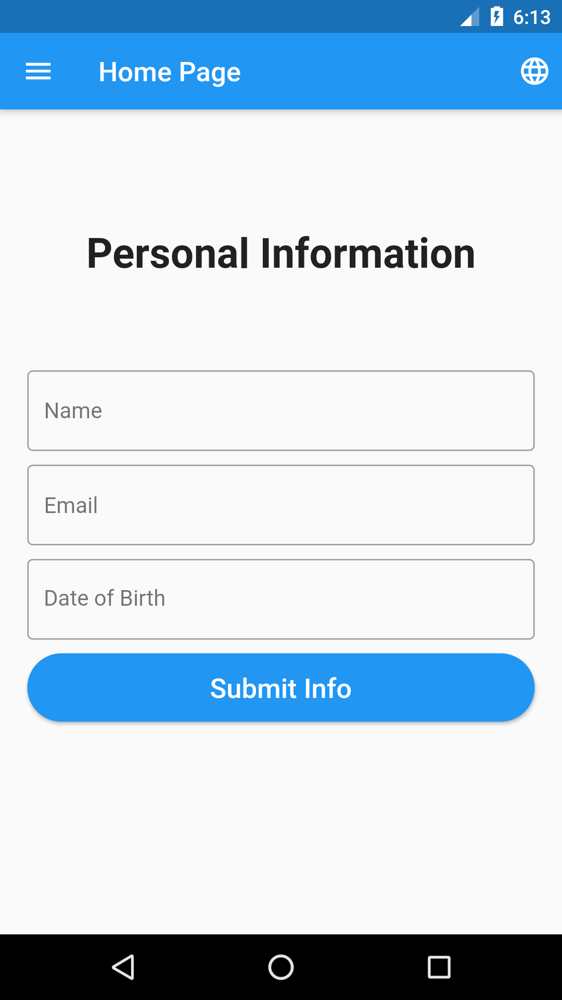
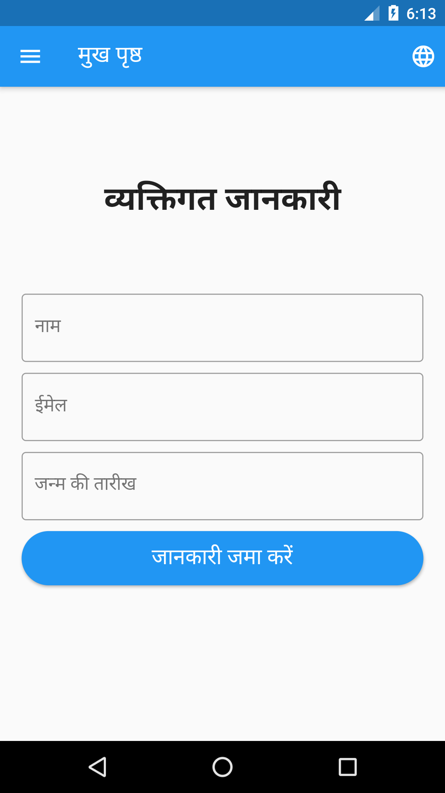
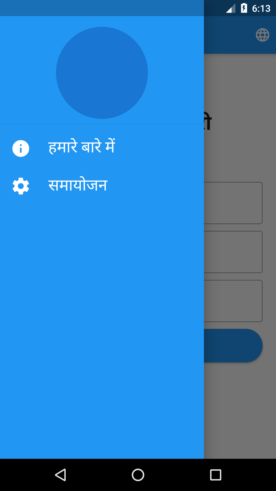
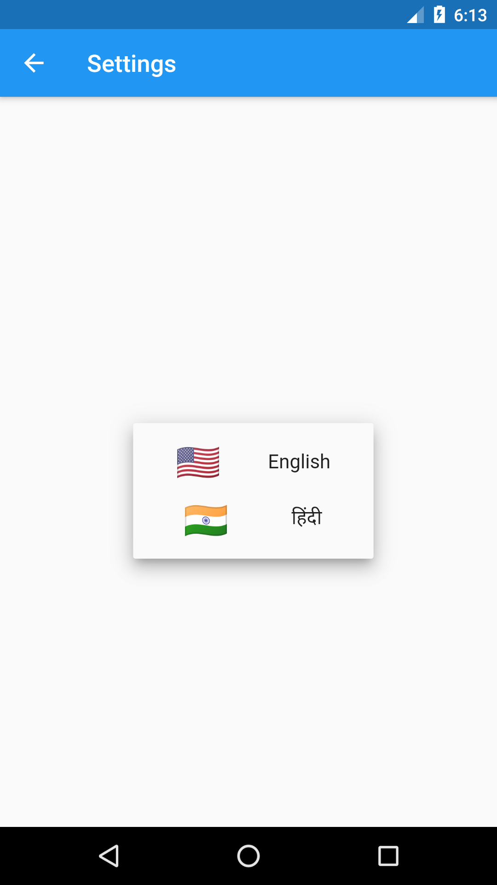

# appLocalisation

A new Flutter project. User can change the language in the settings. These Settings are saved via Shared Preferences so that app loads with user selected language.

# ScreenShots

    
    
